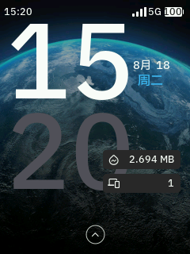
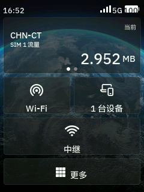
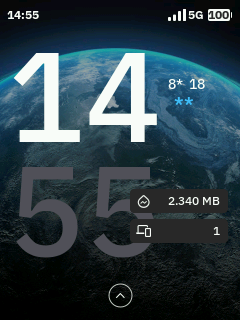

# Mudi 7 触摸屏汉化包

**GL.iNet Mudi 7 (GL-E5800) 2.8 寸触摸屏中文语言包 —— 全网首个**

[](#兼容性)
[](#翻译覆盖)
[](#翻译覆盖)
[](LICENSE)

GL.iNet Mudi 7 的网页面板早就有简体中文，但**那块 2.8 寸触摸屏一直只有英文**。官方语言仓库里给 TFT 屏建的目录 `tftbe3600` 至今是空的 `{}`，社区也没有任何现成方案。

这个项目把它补上了。

---

## 效果

| 锁屏 | 主页 |
|:---:|:---:|
|  |  |
| `8月 18` `周二` | `SIM 1 流量` `1 台设备` `中继` `更多` |

---

## 快速安装

```bash
# 1. 上传到路由器
scp -r mudi7-cn root@192.168.8.1:/tmp/

# 2. 登录并执行
ssh root@192.168.8.1
cd /tmp/mudi7-cn && sh install.sh
```

脚本会自动完成：备份原文件 → 修复字体 → 安装中文 → 重启屏幕服务。装完直接看设备屏幕。

### 卸载

```bash
sh uninstall.sh
```

完整恢复出厂英文界面（文本 + 字体都会还原）。

---

## 兼容性

| 项目 | 值 |
|---|---|
| 设备 | GL.iNet Mudi 7 (GL-E5800) |
| 固件 | 4.10.0 beta4（4.8.5 亦验证可用） |
| 系统 | OpenWrt 23.05.4 / 内核 5.15.170-perf |
| SoC | Qualcomm SDX Pinnacle (SDX75)，Cortex-A55 ×4 |
| 屏幕 | 240×320 RGB565，GC9307C，LVGL + FreeType |

> **理论上适用于所有 GL.iNet 带 TFT 触摸屏的机型**（如 Slate 7），因为字体缺陷是共通的。但文本条目 key 可能不同，需要适配。

---

## 三个技术难点

做这个包的过程中踩了三个坑，都不是"翻译"本身的问题。方案已固化进 `install.sh`，直接用不必自己踩。

### 一、中文被上下裁切

装上中文后，文字**上下各被切掉一截**。

根因在字体度量。对比两个字体的 `hhea` 表：

| 字段 | 中文字体 | 英文字体 |
|---|---|---|
| unitsPerEm | 1000 | 1000 |
| ascender | 880 | 1025 |
| descender | −120 | −275 |
| **lineGap** | **1000** | **0** |
| **行高倍率** | **2.000 em** | **1.300 em** |

中文字体的 `lineGap` 是整整一个 em，导致 LVGL 按 **2.0em** 计算行高，而控件高度是按英文的 **1.3em** 设计的——塞不下，于是上下被裁。

**修法：把 `lineGap` 改成 0，只需 2 个字节。**

```bash
# hhea 表偏移 404，lineGap 位于表内 +8 → 绝对偏移 412
printf '\x00\x00' | dd of=default_cn_medium.ttf bs=1 seek=412 conv=notrunc
```

只改 2 个字节，文件大小不变，其余字节分毫未动。单行标签的裁切随即消失。

### 二、多行文本重叠（lineGap 对它无效）

改完 `lineGap` 后，短信正文这类**多行文本**出现了另一个问题——所有行**重叠糊成一团**。

直觉上会以为是 `lineGap` 调过头了，于是把它改成 300 / 500 / 700 逐个尝试。**全部无效**。

用像素级测量对比才确认：`lineGap=500` 与 `lineGap=700` 的渲染结果**逐像素完全相同**（文字块高 101px、间隙 39px，分毫不差）。

**结论：LVGL 渲染多行文本时，行距由控件自身的 `line_space` 样式属性决定，根本不读字体的 `hhea.lineGap`。**

真正的开关是这个键（在 gl_screen 二进制里，但原厂语言包中并未配置）：

```
SMS_DETAILS_ATTRIBUTE_LABE_TEXT_LINE_SPACE 4
```

> 注意官方把 `LABEL` 拼成了 `LABE`——原厂笔误，必须照抄才生效。

本包已内置该配置，值 `4` 接近原厂英文的紧凑观感。嫌挤可以调大（10 会明显宽松），改完重启 `gl_screen` 即时生效。

**两者分工明确：**

| 参数 | 作用对象 | 值 |
|---|---|---|
| 字体 `hhea.lineGap` | 单行标签（卡片、按钮、菜单） | `0` |
| `..._LINE_SPACE` | 多行文本（短信正文） | `4` |

### 三、中文全部显示成 `*`



上图是故障现场：`8月` 显示成 `8*`，`周二` 显示成 `**`，但**英文和数字完全正常**。

根因是**字体映射**。文本文件开头有一段字体定义：

```
FONT_MEDIUM      "default_medium"       ← 英文字体，无中文字形
FONT_BOLD        "default_bold"         ← 英文字体
FONT_SEMIBOLD    "default_semibold"     ← 英文字体
FONT_MONO_MEDIUM "default_mono_medium"  ← 英文字体
FONT_CN_MEDIUM   "default_cn_medium"    ← 中文字体（原厂定义了但没用上）
```

原厂虽然预装了 8.4 MB 的完整 CJK 字体，却**没有任何标签在用它**。所有标签都指向纯英文字体（218 KB），中文字符找不到字形，就回退成 `*` 占位符。

**修法：把前四个都指向中文字体。**

```
FONT_MEDIUM      "default_cn_medium"
FONT_BOLD        "default_cn_medium"
FONT_SEMIBOLD    "default_cn_medium"
FONT_MONO_MEDIUM "default_cn_medium"
```

> ⚠️ **这一步最容易被忽略**：如果你自己改文本，务必确认字体映射也改了。一旦漏掉，界面上**所有中文都会变成 `*`**。

---

## 顺带修了一个原厂 bug

官方 4.10.0 beta4 的文本文件第 1006 行有个语法错误——两个条目被写在了同一行，中间少了换行：

```
TOR_SETTING_LIST_LABEL_TEXT "Tor"STATUS_EXPLANATION_FAST@CHARGING_LABEL_TEXT "Fast Charging"
```

这导致「快速充电」这个状态标签在**原厂固件上根本无法显示**。本包已拆分修正，装上后比原厂更正确。

---

## 翻译覆盖

**828 条已翻译，覆盖率 85%**（913 条可翻译条目）。

剩余 132 条是**刻意保留英文**的，全部核对过：

| 类别 | 示例 |
|---|---|
| 无线/射频术语 | `BSSID` `ARFCN` `RSRP` `RSRQ` `SINR` `TAC` `PCI` |
| 协议与标准 | `DHCP` `PPPoE` `NAT6` `QoS` `SQM` `MLO` `TAP-S2S` |
| 蜂窝标识 | `IMEI` `ICCID` `IMSI` `EID` `APN` `5G SA` `5G NSA` |
| 产品名 | `GoodCloud` `AstroWrap` `AdGuard Home` `Tor` `Tailscale` |
| 频段与接口 | `2.4GHz` `5GHz` `6GHz` `WAN` `LAN` `USB 3.1` |
| 单位 | `KB` `MB` `GB` |

这些译成中文反而不专业，也不符合网络设备的行业惯例。

### 译法约定

小屏幕空间有限，按控件类型控制字数：

| 控件 | 字数 | 例 |
|---|---|---|
| 首页卡片 | 2 字 | `Ethernet` → **有线**，`Repeater` → **中继** |
| 按钮 | 2 字 | `Submit` → **提交**，`Cancel` → **取消** |
| 标题栏 | 4–6 字 | `Wi-Fi Password` → **Wi-Fi 密码** |
| 说明文字 | 不限 | 完整翻译（在滚动区域，不受行高限制） |

---

## 附带工具：远程截屏

`tools/screenshot.sh` 可以**直接抓取屏幕内容**，不用拆机也不用拍照——调试时极为有用。

```bash
sh tools/screenshot.sh myshot
```

原理是直接 dump framebuffer 再转 PNG：

```bash
dd if=/dev/fb0 bs=153600 count=1   # 240×320×2 = 153600 字节，RGB565
```

本仓库所有截图都由它生成。

---

## 目录结构

```
mudi7-cn/
├── install.sh              一键安装（含字体修复）
├── uninstall.sh            完全卸载，恢复出厂
├── lang/
│   ├── default.zh-cn       中文语言包（828 条）
│   └── default.en.bak      原厂英文备份
├── tools/
│   └── screenshot.sh       远程截屏工具
└── screenshots/            效果与故障截图
```

---

## 已知限制

**主页运营商显示（如 `CHN-CT`）无法汉化。** 该字符串由基带直接从 SIM 卡读取，不经过屏幕语言包——语言包里根本不存在这个词。要改需要修改基带 EFS 中的 PLMN/EONS 运营商名称表，属于基带层改动，风险远高于界面汉化，本项目不涉及。

---

## 注意事项

- **升级固件会覆盖汉化**。`/etc/gl_screen/` 下的改动不会保留，升级后重新执行 `install.sh` 即可。
- **首次安装会自动备份**原始文本和字体（`.bak`），卸载时用于还原。请勿删除。
- 本包**只改屏幕显示**，不涉及网络、认证、基带或任何数据通路。

---

## 致谢与许可

字体与原始文本版权归 GL.iNet 所有。本项目仅提供中文翻译与显示修复，以 [MIT](LICENSE) 许可发布。

欢迎提 Issue 反馈漏译或译法问题。